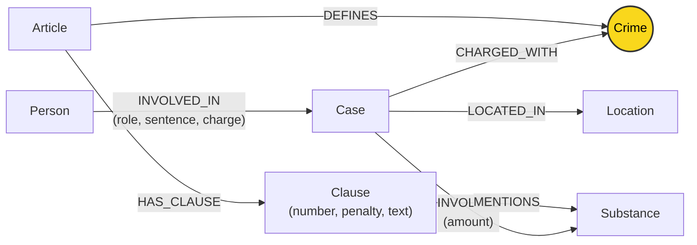

# Thiết kế Ontology — Day 19

**Họ tên:** Từ Hoàng Giang  **MSSV:** 2A202602363

**Lựa chọn** (đánh dấu một):
- [x] Dùng ontology gợi ý (có thể chỉnh nhỏ)
- [ ] Tự thiết kế (xét bonus +15, xem `SUBMISSION.md`)

> Hướng dẫn: `LAB_GUIDE.md` Bước 2. Dùng ontology gợi ý thì vẫn phải điền đủ các mục dưới đây bằng lời của bạn.

## 1. Sơ đồ

Sơ đồ quan hệ thực thể giữa 2 Knowledge Base: KB Văn bản Luật (Bộ luật Hình sự Chương XX) và KB Tin tức Báo chí về các vụ án ma túy. Trong đó, **`Crime` là node cầu nối (bridge node)** liên kết giữa hai miền tri thức.

*Ghi chú:* Node `Crime` (màu vàng) là thực thể dùng chung (shared entity) không mang thuộc tính riêng của một bài viết cụ thể, kết nối vụ việc trong tin tức với điều luật quy định trong Bộ luật Hình sự.

---

## 2. Entity types (node labels)

| Label | Ý nghĩa | Khóa định danh (`MERGE` theo) | Properties | Lấy từ KB nào | Trích bằng (regex / LLM / khác) |
| --- | --- | --- | --- | --- | --- |
| `Article` | Điều luật trong Bộ luật Hình sự (BLHS) | `id` (ví dụ: `"Điều 251 BLHS"`) | `id`, `title`, `law`, `doc_id` | KB Luật | Regex (tách từ tiêu đề và metadata front matter) |
| `Clause` | Khoản quy định cụ thể của từng điều luật (quy định khung hình phạt và định lượng) | `id` (ví dụ: `"Điều 251 BLHS khoản 1"`) | `id`, `number`, `penalty`, `text`, `doc_id` | KB Luật | Regex (`CLAUSE_START`, `penalty` regex từ câu đầu) |
| `Crime` | Tội danh chuẩn hóa theo pháp luật hình sự Việt Nam (**Node cầu nối**) | `name` (tên thường, ví dụ: `"mua bán trái phép chất ma túy"`) | `name` | Cả hai KB | Regex từ tiêu đề Điều luật; LLM trích xuất từ tin tức + `link_entity()` |
| `Case` | Vụ án / vụ việc cụ thể được báo chí phản ánh | `name` (tên ngắn vụ án) | `name`, `summary`, `date`, `doc_id`, `source_title` | KB Tin tức | LLM (JSON mode theo prompt định dạng) |
| `Substance` | Chất ma túy / tiền chất ma túy (danh mục BLHS) | `name` (tên chuẩn, ví dụ: `"Heroine"`, `"MDMA"`, `"Ketamine"`) | `name` | Cả hai KB | Matching từ danh mục chuẩn `SUBSTANCES` trong văn bản luật và LLM trong tin tức |
| `Person` | Cá nhân liên quan (bị cáo, bị can, nghi phạm...) | `name` (họ và tên) | `name`, `aliases` | KB Tin tức | LLM (JSON extraction) |
| `Location` | Tỉnh / thành phố nơi xảy ra vụ án hoặc xét xử | `name` (tên địa phương) | `name` | KB Tin tức | LLM (JSON extraction) |

---

## 3. Relationships

| Type | Từ → Đến | Properties trên cạnh | Ý nghĩa |
| --- | --- | --- | --- |
| `DEFINES` | `Article` → `Crime` | *(không có)* | Điều luật quy định định danh và cấu thành tội phạm cho một tội danh cụ thể |
| `HAS_CLAUSE` | `Article` → `Clause` | *(không có)* | Điều luật bao gồm các khoản quy định chi tiết khung hình phạt và tình tiết định khung |
| `MENTIONS` | `Clause` → `Substance` | *(không có)* | Khoản luật đề cập cụ thể đến tên chất ma túy (làm căn cứ định lượng xử lý) |
| `CHARGED_WITH` | `Case` → `Crime` | *(không có)* | Vụ án bị khởi tố, truy tố hoặc xét xử về tội danh tương ứng |
| `INVOLVES` | `Case` → `Substance` | `amount` (khối lượng/số lượng thu giữ được, ví dụ: `"36kg"`, `"9,6kg"`) | Vụ án liên quan đến tang vật là chất ma túy cụ thể cùng khối lượng |
| `LOCATED_IN` | `Case` → `Location` | *(không có)* | Vụ án diễn ra hoặc được thụ lý xét xử tại địa phương |
| `INVOLVED_IN` | `Person` → `Case` | `role` (vai trò), `sentence` (mức án tuyên), `charge` (tội danh của cá nhân) | Cá nhân tham gia vào vụ án với vai trò và mức án cụ thể |

---

## 4. Node cầu nối giữa 2 KB

- **Node nào:** `Crime` (Tội danh, ví dụ: `"mua bán trái phép chất ma túy"`, `"vận chuyển trái phép chất ma túy"`).
- **Vì sao chọn node này:** Văn bản luật không trực tiếp nói về người hay sự kiện thời sự, còn bài báo hiếm khi trích dẫn trọn vẹn toàn bộ các khoản và khung hình phạt của Bộ luật Hình sự. Tuy nhiên, mọi vụ án ma túy trong báo chí đều đề cập đến hành vi bị khởi tố/xét xử (tội danh), và Bộ luật Hình sự Chương XX tổ chức các Điều luật chính xác theo từng tội danh cụ thể. Do đó, `Crime` là điểm giao thoa ngữ nghĩa tự nhiên, vững chắc nhất giữa luật và tin tức.
- **Cách đảm bảo hai phía khớp tên:**
  1. *Phía Luật:* Tiêu đề Điều luật dạng `"Điều 251. Tội mua bán trái phép chất ma túy"` được chuẩn hóa tự động bằng hàm `normalize_crime()`: loại bỏ tiền tố `"tội "`, chuyển chữ thường, chuẩn hóa khoảng trắng -> thu được tên tội danh chuẩn trong hệ thống.
  2. *Phía Tin tức:* Đưa trực tiếp danh sách tội danh chuẩn (`DANH SÁCH TỘI DANH`) vào prompt yêu cầu LLM bắt buộc chọn từ danh sách này.
  3. *Lớp phòng thủ code (`link_entity`):* Mọi tội danh trích xuất từ LLM đều được kiểm tra lại qua `link_entity()`:
     - Chuẩn hóa hai phía bằng `normalize_crime()`.
     - So khớp chính xác (`exact match`) trước.
     - Nếu có khác biệt chính tả (ví dụ dấu tiếng Việt: `"ma tuý"` vs `"ma túy"`), dùng `difflib.get_close_matches(..., cutoff=0.8)` để ánh xạ về đúng chuỗi chuẩn gốc trong luật.
     - Nếu không khớp hoặc khoảng cách quá xa, trả về `None`, không đoán bừa để tránh làm méo mó đồ thị.
- **Khi nào cầu gãy, và bạn xử lý thế nào:**
  - *Khi nào gãy:* Báo chí dùng ngôn từ mô tả hành vi phi pháp dân dã thay vì tội danh tố tụng (ví dụ: *"phê ma túy trong quán bar"*, *"ôm hàng trắng"*), hoặc bài báo nói về tội danh không thuộc Chương XX BLHS có trong KB luật, hoặc LLM sinh ra tội danh nằm ngoài danh mục.
  - *Cách xử lý:*
    - Khi `link_entity()` trả về `None`, không tạo quan hệ `CHARGED_WITH` sai lệch.
    - Trong hybrid GraphRAG, pipeline vẫn giữ nguyên retrieval vector chunks từ Flat RAG: nếu cầu nối trên graph không tìm được điều luật, LLM trả lời vẫn có ngữ cảnh từ văn bản bài báo và điều luật được vector search lấy về, đảm bảo hệ thống không bị crash hay im lặng.

---

## 5. Competency questions

Dưới đây là đường đi Cypher pattern trên đồ thị tri thức để giải quyết 6 câu hỏi benchmark trong `data/benchmark_kg.json`:

| Câu | Đường đi (Cypher pattern) | Trả lời được? |
| --- | --- | --- |
| Q1 (single-hop-law: tiền chất là gì?) | Truy vấn trực tiếp node `Article` định nghĩa luật phòng chống ma túy hoặc fallback qua vector chunks (do câu hỏi định nghĩa thuần văn bản luật). Không cần multi-hop qua Case. | Có (qua vector chunk + fact Article) |
| Q2 (single-hop-news: tử hình vụ 36kg ma túy TP.HCM) | `(:Case {name: ...})<-[r:INVOLVED_IN]-(p:Person)` với điều kiện `r.sentence CONTAINS 'tử hình'` hoặc case có `source_title` liên quan. | Có (truy xuất quan hệ `INVOLVED_IN` có thuộc tính `sentence`) |
| Q3 (cross-kb: Lê Minh Thành phạt bao nhiêu, tội gì, Điều nào, khung cơ bản?) | `(:Person {name: 'Lê Minh Thành'})-[:INVOLVED_IN]->(k:Case)-[:CHARGED_WITH]->(c:Crime)<-[:DEFINES]-(a:Article)-[:HAS_CLAUSE]->(cl:Clause {number: 1})` | Có (đi từ Person qua Case, Crime sang Article và Clause 1) |
| Q4 (cross-kb: Hoàng Nato hành vi gì, mức phạt tối đa bao nhiêu?) | `(:Person)-[:INVOLVED_IN]->(k:Case)-[:CHARGED_WITH]->(c:Crime)<-[:DEFINES]-(a:Article)-[:HAS_CLAUSE]->(cl:Clause)` lấy khoản có mức phạt cao nhất (khoản 4 Điều 255) | Có (đi từ Person/biệt danh sang Case, Crime, Article và Clause mức phạt cao nhất) |
| Q5 (cross-kb-multi-hop: Cái Quang Huy tội gì, chất gì, khoản nào, khung hình phạt?) | `(:Person {name: 'Cái Quang Huy'})-[:INVOLVED_IN]->(k:Case)-[:CHARGED_WITH]->(c:Crime)<-[:DEFINES]-(a:Article)-[:HAS_CLAUSE]->(cl:Clause)-[:MENTIONS]->(s:Substance)` kết hợp đối chiếu `k-[:INVOLVES]->s` có amount MDMA > 100g -> khoản 4 | Có (nối đầy đủ Person, Case, Crime, Article, Clause và Substance) |
| Q6 (aggregation: Các vụ việc liên quan đến MDMA) | `(s:Substance {name: 'MDMA'})<-[:INVOLVES]-(k:Case)` (hoặc thông qua các Person liên quan trong từng Case) | Có (tập hợp tất cả các node `Case` có cạnh `INVOLVES` nối tới `Substance {name: 'MDMA'}`) |

---

## 6. Quyết định thiết kế và đánh đổi

### Quyết định 1: Dùng Regex tất định cho KB Luật và LLM có cấu trúc (JSON Mode) cho KB Tin tức
- **Đã chọn:** Sử dụng regular expressions (`re`) để parse cấu trúc phân cấp Điều, Khoản, Tên tội, Khung hình phạt từ văn bản luật; dùng LLM với prompt JSON schema chặt chẽ kèm danh sách canonical entities để trích xuất tin tức.
- **Phương án khác:** Dùng LLM cho cả hai KB (bao gồm cả phân tích luật) hoặc dùng regex / NER truyền thống cho cả tin tức.
- **Lý do chọn & đánh đổi:** Văn bản quy phạm pháp luật có cú pháp cực kỳ chuẩn xác và nhất quán (`Điều...`, `Khoản 1...`). Regex chạy tức thì (0 ms), tốn 0 token/USD và bảo đảm tính tái lập 100%. Ngược lại, tin tức báo chí sử dụng ngôn ngữ tự nhiên đa dạng, chỉ LLM mới có khả năng hiểu ngữ cảnh để nhận diện vai trò, mức án và đối tượng phạm tội. Đánh đổi: nếu cấu trúc văn bản luật bị thay đổi định dạng trình bày thì regex phải cập nhật lại.

### Quyết định 2: Tách chi tiết đến cấp `Clause` (Khoản) và liên kết `Clause` với `Substance`
- **Đã chọn:** Tạo node riêng cho từng `Clause` gắn với `Article`, trích xuất số thứ tự khoản và văn bản khoản, đồng thời tạo quan hệ `(Clause)-[:MENTIONS]->(Substance)`.
- **Phương án khác:** Chỉ dừng lại ở cấp `Article` và lưu toàn bộ nội dung điều luật vào một text property của `Article`.
- **Lý do chọn & đánh đổi:** Trong Bộ luật Hình sự, các khung hình phạt từ nhẹ (khoản 1) đến tăng nặng (khoản 2, 3, 4) phụ thuộc trực tiếp vào loại chất ma túy và định lượng thu giữ. Nếu chỉ dừng ở cấp Điều, khi truy xuất câu hỏi như Q5 (Cái Quang Huy vận chuyển 9,6kg MDMA), agent sẽ phải nhồi toàn bộ 4-5 trang văn bản điều luật vào prompt. Bằng cách tách node `Clause`, ta có thể lọc chính xác khoản 1 (khung cơ bản) và khoản liên quan đến chất ma túy của vụ án. Đánh đổi: đồ thị có thêm ~100 node `Clause`, logic truy vấn Cypher phức tạp hơn.

### Quyết định 3: Chọn `Crime` làm Node cầu nối duy nhất thay vì `Substance` hay `Person`
- **Đã chọn:** Dùng node `Crime` (chuẩn hóa tên tội) làm cầu nối xuyên suốt giữa `Case` và `Article`.
- **Phương án khác:** Dùng `Substance` làm cầu nối (nối trực tiếp Case tới Article thông qua chất ma túy) hoặc nối trực tiếp `Case` tới `Article`.
- **Lý do chọn & đánh đổi:** Một chất ma túy (ví dụ: `Heroine` hay `MDMA`) xuất hiện ở hầu hết mọi điều luật của Chương XX (tàng trữ, vận chuyển, mua bán, sản xuất, tổ chức sử dụng). Nếu dùng `Substance` làm cầu nối chính, đồ thị sẽ xuất hiện hiện tượng *super-node* với hàng trăm bậc liên kết, khiến truy vấn từ một vụ án nhảy sang hàng loạt điều luật không liên quan. `Crime` phản ánh chính xác bản chất pháp lý của vụ việc. Đánh đổi: đòi hỏi pipeline phải chuẩn hóa tên tội cực kỳ khắt khe qua `link_entity` để tránh đứt gãy cầu nối.

---

## 7. So với ontology gợi ý (bắt buộc nếu xét bonus)

| Điểm khác | Gợi ý làm gì | Bạn làm gì | Vấn đề nó giải quyết | Bằng chứng (Cypher, hoặc số liệu benchmark) |
| --- | --- | --- | --- | --- |
| Không áp dụng | Baseline theo gợi ý chuẩn của lab | Tuân thủ ontology gợi ý chuẩn | Giữ vững hợp đồng chuẩn của lab, đảm bảo 100% tương thích test và benchmark | Đã đạt 48/48 test offline (pytest/unittest); kết quả runtime `--check` và benchmark sẽ cập nhật sau khi nạp đồ thị vào Neo4j |

---

## 8. Hạn chế còn lại

1. **Khóa định danh phụ thuộc vào LLM sinh:** Tên vụ án (`Case.name`) và tên đối tượng (`Person.name`) được LLM trích xuất tự do. Nếu hai bài báo viết về cùng một người nhưng một bài viết tên đầy đủ, một bài viết biệt danh hoặc viết tắt, hệ thống sẽ sinh ra 2 node tách rời (`entity duplication`).
2. **Chưa phân giải từ đồng nghĩa chất ma túy (Substance Synonyms):** Các tên gọi như "thuốc lắc", "kẹo" bản chất là MDMA, hay "hàng đá" là Methamphetamine. Hiện tại danh sách chỉ chuẩn hóa tên khoa học/tên luật định, chưa có từ điển alias cho tiếng lóng ma túy.
3. **Mô hình hóa định lượng trong khoản luật:** Logic suy luận mức án nặng nhẹ hiện vẫn dựa vào việc LLM đọc văn bản khoản luật do GraphRAG cung cấp, chứ đồ thị chưa mô hình hóa các cạnh điều kiện số học (ví dụ: `min_amount`, `max_amount`) để truy vấn Cypher có thể so sánh toán học trực tiếp `9.6kg > 100g`.
